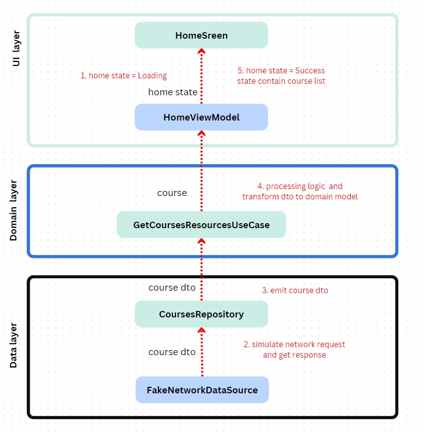

請使用 Kotlin 實作一個 app 首頁課程列表畫面，並寫文件或註解來解釋你的設計考量。除了指定需求外，你可以自由設計 model 和 UI 來提供更好的體驗。

## 技術規定

- Deployment Target 為 Android 12。
- 可使用第三方 library。
- 請寫文件或註解來解釋你的設計考量。

## 需求

請實作一個在 app 首頁看到的課程列表，需求如下：

#### 資料

- 請設計一個的 Data Loader 的抽象層來提供課程資料。
- 請用專案中提供的 json file 實作上述 Data Loader 的一個實例。

#### UI 設計

- 依照課程當前狀態，顯示不同的標籤
- 課程標題至多兩行
- 本題目不用在意卡片尺寸、顏色、間距等細節，請將重點放在如何排版。（你仍然可以盡量符合示意圖）
  

## 提交

- 請下載或 fork Hahow Android Engineer 面試題目初始專案。
- 請將成果上傳至 GitHub 並直接提供 repo 連結。

## 技術文件

### Library & UI 框架

- JetPack Compose
    - 使用 Jetpack Compose 可以簡化 UI 開發流程，作為宣告式 UI 框架，讓開發者更專注於描述 UI 的外觀和行為。
- hilt
    - Hilt 是一個基於 Dagger 的依賴注入框架，它提供簡單且標準化的方式來管理依賴。使用 Hilt 可以提高專案的可維護性和可測試性，並降低模組之間的耦合度。
- landscapist
    - Landscapist 是一個用於 Jetpack Compose 的圖片加載函式庫，提供 loading、failure、preview 等等支援。
- kotlinx serialization
    - Kotlinx Serialization 是一個 Kotlin 跨平台的序列化函式庫。使用它可以輕鬆地將 JSON 資料與 Kotlin 物件相互轉換，並且與 Kotlin
      標準函式庫無縫集成。

### 架構

- MVVM with clean architecture
    - 使用 MVVM 架構與 Clean Architecture，將業務邏輯、資料存取和 UI 分層管理。這樣的架構有助於專案的可維護性、可測試性，並降低各層之間的耦合度。
- multi module(app、domain、data) : 模組化能夠降低專案之間的耦合度，清楚的定義
  dependency，提高專案的可擴展性、可維護性、可測試性，提高專案建構速度，並有助於提高團隊的開發效率。
    - app - UI elements、State Holder(ViewModel)
    - domain - usecase 用於封裝業務邏輯
        - 在 usecase 中可以處理從 remote or local 端拿到的資料邏輯，例如超過募資期限且未募資成功的課程不顯示、募資進度、剩餘天數的計算，並將 DTO 轉換成
          domain model
    - data - repository、datasource
        - 統一透過 repository 與 datasource 交流，在這個專案中我做了一個 FakeNetworkDataSource 用以模擬向 remote 端拿資料的情境

- 架構遵循 reactive programming model with unidirectional data flow。數據層位於底部，主要概念如下：
  - Higher layers 響應 lower layers 的變化。
  - Events 從上往下流動。
  - Data 從下往上流動。

  下圖為當 app start 之後 init ViewModel invoke GetCoursesResourcesUseCase 之後的 data flow
  

    
  
